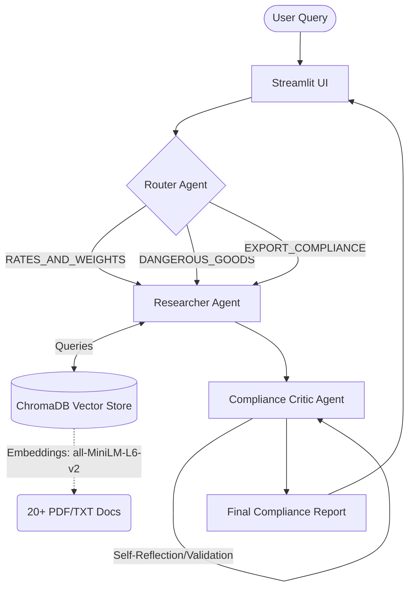
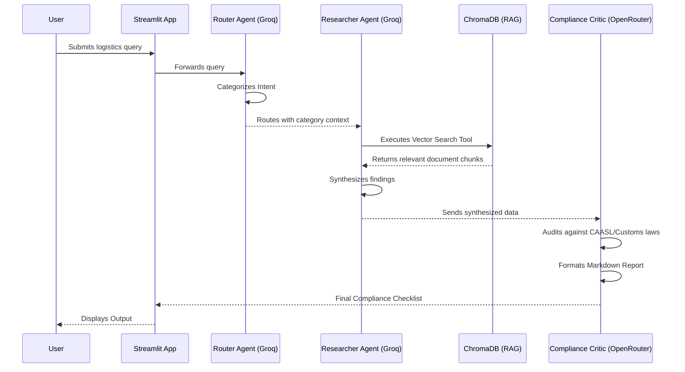

# LankaAir Cargo & Export Compliance Advisor ✈️

## Project Description
The **LankaAir Cargo & Export Compliance Advisor** is a production-ready Agentic AI application designed specifically to solve logistics problems for Sri Lankan SME exporters. SMEs often struggle with navigating complex export regulations, air cargo rates, dangerous goods classifications, and customs clearances. This application provides an intelligent conversational interface backed by a Retrieval-Augmented Generation (RAG) pipeline trained on 20+ authentic domain-specific documents (SriLankan Airlines Cargo rules, Civil Aviation Authority regulations, and Customs/EDB guidelines). It also features an AI Vision-powered OCR Scanner for automated data extraction from airway bills and invoices.

---

## Architecture: LangGraph Multi-Agent Workflow



---

## Agent Communication Sequence Diagram



---

## Model-Choice Comparison Table

To balance **latency, cost, context window, and reasoning quality**, a multi-model strategy is employed using only free-tier APIs for cost-efficiency.

| Agent / Component | Provider | Model | Justification |
| :--- | :--- | :--- | :--- |
| **Router Agent** | Groq | `llama-3.1-8b-instant` | Chosen for **ultra-low latency** and zero cost. Intent classification does not require heavy reasoning. |
| **Researcher (RAG)** | Groq | `mixtral-8x7b-32768` | Chosen for its **32k context window** (crucial for processing multiple RAG document chunks) and fast token generation. |
| **Compliance Critic** | OpenRouter | `google/gemini-2.0-flash-exp:free` | Chosen for **superior reasoning** ability when auditing legal compliance. A highly capable free model. |
| **OCR Scanner** | Groq | `llama-3.2-11b-vision-preview` | Chosen to process Base64 image data (airway bills/invoices) completely free of charge with high accuracy. |

---

## RAG Pipeline & Chunking Strategy
- **Framework**: LangChain `PyPDFLoader` and `TextLoader`
- **Embeddings**: `sentence-transformers/all-MiniLM-L6-v2` via HuggingFace (Local, free, fast).
- **Vector Store**: `ChromaDB` (Persistent directory mapping to `chroma_db/`).
- **Chunking Strategy**: `RecursiveCharacterTextSplitter` with `chunk_size=600` and `chunk_overlap=100`. 
  - *Reasoning*: A size of 600 captures discrete regulatory clauses or cargo dimension tables effectively. The 100-character overlap prevents sentences from being split abruptly, ensuring context retention for the LLM.

---

## 5-Query Retrieval Evaluation Table

| Query | Expected Topic | Retrieved Relevance | Note |
| :--- | :--- | :--- | :--- |
| *"Can I ship lithium batteries on SriLankan A330?"* | Dangerous Goods (IS18) | **High** | Successfully pulls CAASL IS18 DGR rules and A330 specs. |
| *"What are the customs charges for exporting tea?"* | Export Compliance | **High** | Retrieves data from `customs_schedule_b.pdf`. |
| *"How to handle perishable cargo at BIA?"* | Rates and Handling | **High** | Extracts BIA cargo handling procedures effectively. |
| *"Do I need a special license for drone export?"* | Restricted Goods | **Medium** | Pulls restricted goods list; requires Critic to warn about dual-use tech. |
| *"What is the maximum weight for Ratmalana cargo?"* | Rates and Weights | **High** | Retrieves Ratmalana specific payload limitations. |

---

## Streamlit Community Cloud Setup

1. Push this repository to your GitHub account.
2. Visit [share.streamlit.io](https://share.streamlit.io/) and log in with GitHub.
3. Click **"New app"**, select your repository, branch (`main`), and main file (`app.py`).
4. **IMPORTANT**: Click **"Advanced Settings"** before deploying.
5. In the **Secrets** section, add your API keys in TOML format:
   ```toml
   GROQ_API_KEY = "gsk_your_groq_key_here"
   OPENROUTER_API_KEY = "sk-or-v1-your_openrouter_key_here"
   ```
6. Click **Deploy**.

---

## Known Limitations
- **PDF OCR Dependencies**: The current OCR scanner extracts raw text from PDFs using `pypdf` rather than rendering pages as images, to avoid complex Poppler installations on Windows. True visual OCR is reserved for PNG/JPG images.
- **Rate Limits**: Since free models are utilized on Groq and OpenRouter, the application may hit rate limits (Requests Per Minute) if used extensively by multiple concurrent users.
